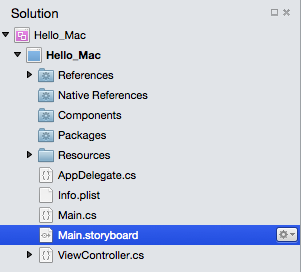
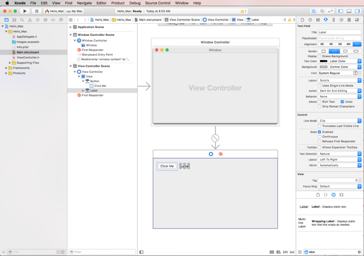
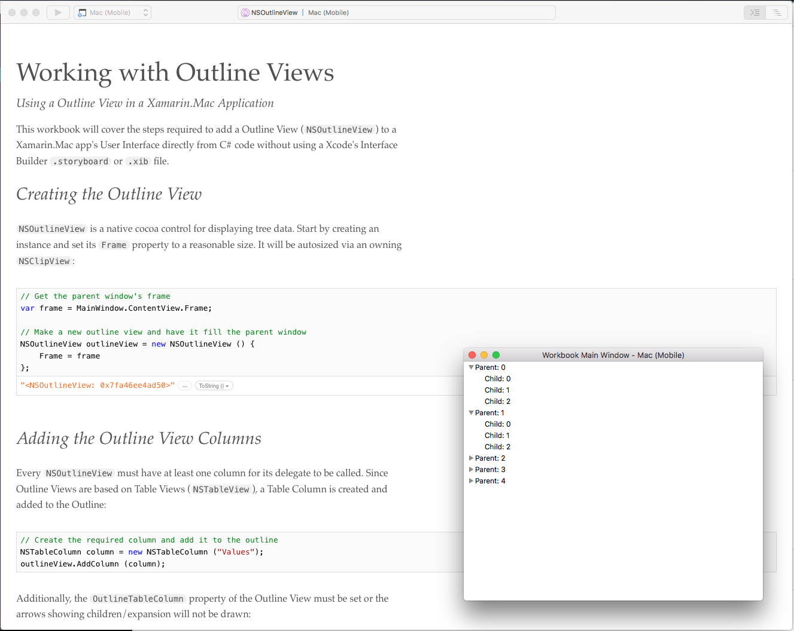
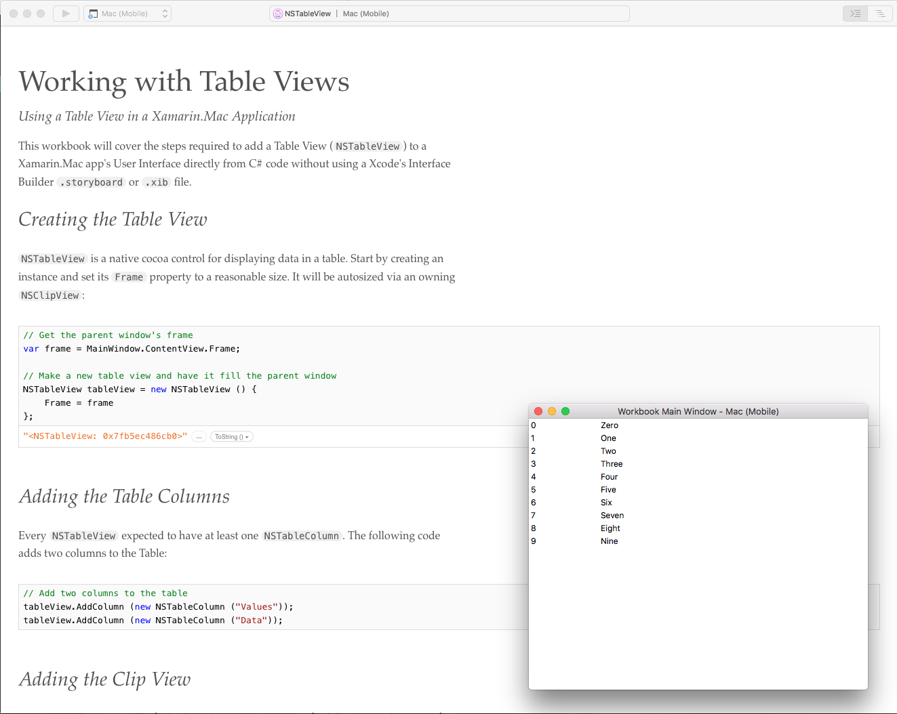
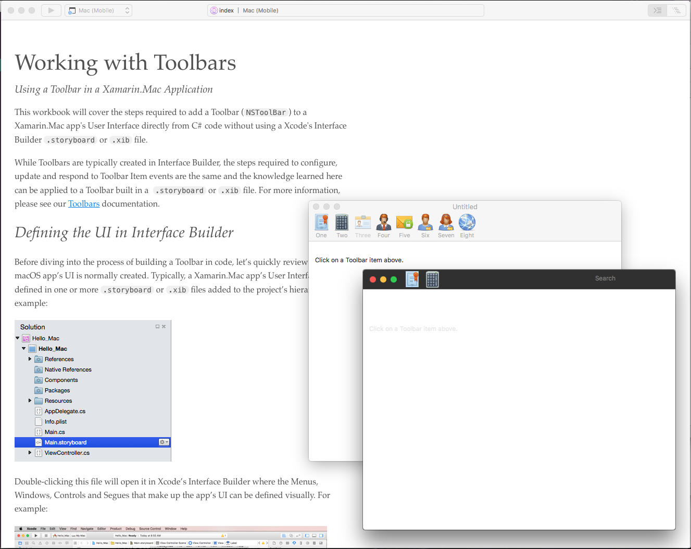
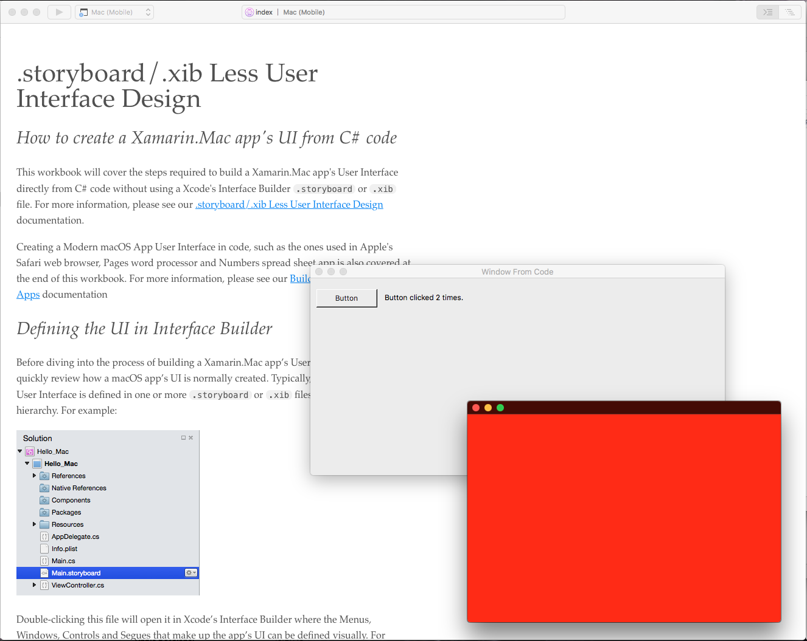

# Xamarin.Mac User Interface Workbooks

The workbooks in this section cover many of the common elements used to create a Xamarin.Mac app's User Interface such as Windows, Toolbars and Table Views.

Because of the way workbooks function, each workbook in this section will cover the steps required to build a Xamarin.Mac app's User Interface directly from C# code without using a Xcode's Interface Builder `.storyboard` or `.xib` file.

## Defining a UI in Interface Builder

Before diving into the process of building a Xamarin.Mac app’s User Interface in code, let’s quickly review how a macOS app’s UI is normally created. Typically, a Xamarin.Mac app’s User Interface is defined in one or more `.storyboard` or `.xib` files added to the project’s hierarchy. For example:

Double-clicking this file will open it in Xcode’s Interface Builder where the Menus, Windows, Controls and Segues that make up the app’s UI can be defined visually. For example:

When the UI layout is completed, the graphical elements that make up the UI are then exposed via **Actions** and **Outlets**, making them accessible to code. When the developer saves their changes to the Main.storyboard file and returns to Xamarin Studio, these changes are synced with the Xamarin.Mac app’s Project File and the UI elements are then accessible in C#.

For more information, please see our [Hello, Mac](https://developer.xamarin.com/guides/mac/getting_started/hello,_mac/) and [Introduction to Storyboards](https://developer.xamarin.com/guides/mac/platform-features/storyboards/) documentation.

# Available Workbooks

The following User Interface workbooks are available for Xamarin.mac:

## [Working with Outline Views](outlineview)

This workbook will cover the steps required to add a Outline View (`NSOutlineView`) to a Xamarin.Mac app's User Interface directly from C# code without using a Xcode's Interface Builder `.storyboard` or `.xib` file.

## [Working with Table Views](tableview)

This workbook will cover the steps required to add a Table View (`NSTableView`) to a Xamarin.Mac app's User Interface directly from C# code without using a Xcode's Interface Builder `.storyboard` or `.xib` file.

## [Working with Toolbars Workbook](toolbars)

This workbook will cover the steps required to add a Toolbar (NSToolBar) to a Xamarin.Mac app's User Interface directly from C# code without using a Xcode's Interface Builder `.storyboard` or `.xib` file.

## [.storyboard/.xib Less User Interface Design Workbook](ui-in-code)

This workbook will cover the steps required to build a Xamarin.Mac app's User Interface directly from C# code without using a Xcode's Interface Builder `.storyboard` or `.xib` file.

